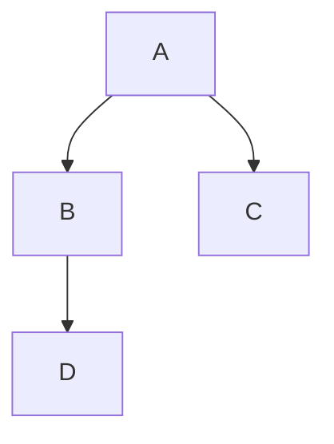
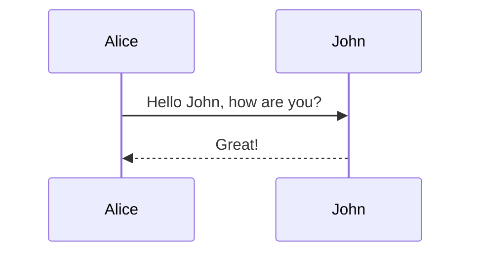
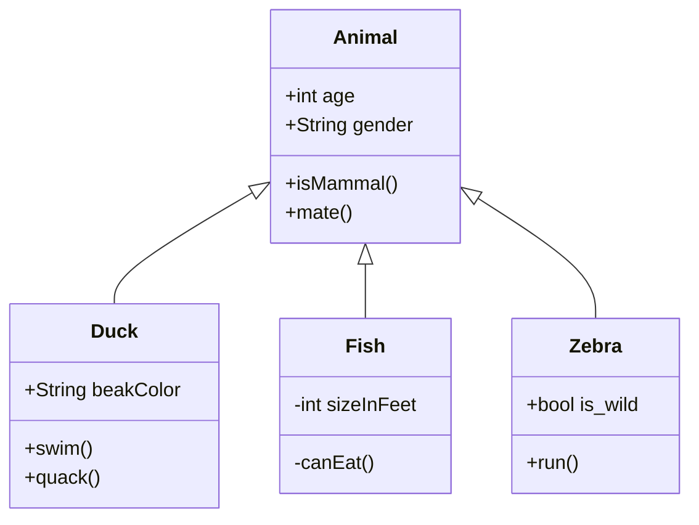
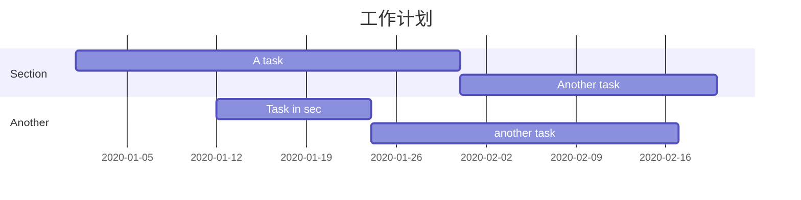
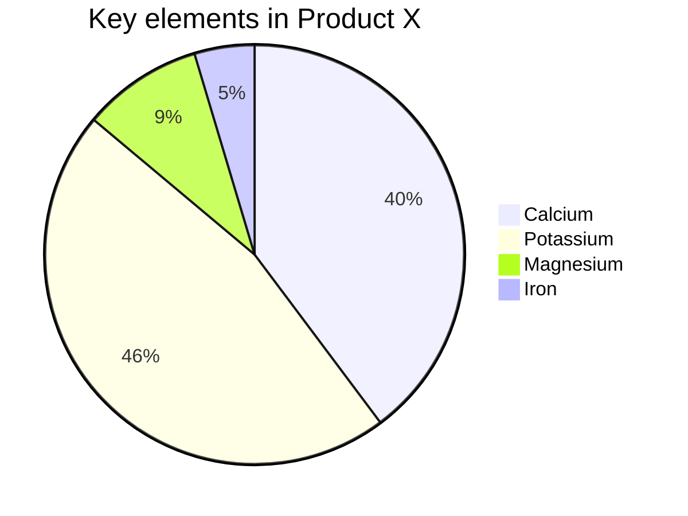

---
{"dg-publish":true,"permalink":"/系统/示例/画图/","noteIcon":"1","created":"2023-04-03T12:57:37.312+08:00","updated":""}
---

# 画图
### Mermaid

[Mermaid](https://mermaid.js.org/#/) 是一种简单的类似 Markdown 的脚本语言，通过 JavaScript 编程语言，将文本转换为图片。因此，真正实现画图功能的并不是 Typora 本身，它只是内置了对 Mermaid 的支持。

### 流程图

语法解释：`graph` 关键字就是声明一张流程图，`TD` 表示的是方向，这里的含义是 Top-Down 由上至下。

### 时序图

语法解释：`->>` 代表实线箭头，`-->>` 则代表虚线。

### 状态图

语法解释：`[*]` 表示开始或者结束，如果在箭头右边则表示结束。

### 类图

语法解释：`<|--` 表示继承，`+` 表示 `public`，`-` 表示 `private`，学过 Java 的应该都知道。

### 甘特图
甘特图一般用来表示项目的计划排期，目前在工作中经常会用到。

语法也非常简单，从上到下依次是图片标题、日期格式、项目、项目细分的任务。

### 饼图
饼图使用 `pie` 表示，标题下面分别是区域名称及其百分比。

